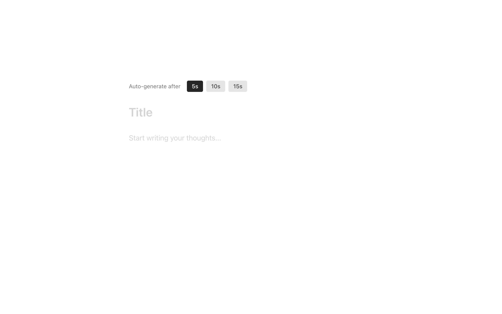

# Ambient Canvas Clone



## Overview

This is a clone of the Ambient Canvas app (i saw on twitter). It features a minimal, borderless white canvas UI with a title and text field, and generates thoughts, to help you find insipration writing, using an AI backend.

## Features
- Responsive, clean, and accessible UI
- Auto-generates a thought after a period of inactivity (user-selectable)
- Toast notification for generated thoughts
- Next.js App Router, Tailwind CSS, shadcn/ui
- **Authentication with Clerk (login/signup)**

## Getting Started

1. Install dependencies:
   ```bash
   npm install
   # or
   yarn install
   ```
2. Set up environment variables:
   - `OPENAI_API_KEY=...`
   - `NEXT_PUBLIC_CLERK_PUBLISHABLE_KEY=...`
   - `CLERK_SECRET_KEY=...`
3. Run the development server:
   ```bash
   npm run dev
   # or
   yarn dev
   ```
4. Open [http://localhost:3000](http://localhost:3000) to view the app.

## Clerk Authentication

This project uses [Clerk](https://clerk.com/) for authentication. You need to create a Clerk project and add your keys to `.env`:

```
NEXT_PUBLIC_CLERK_PUBLISHABLE_KEY=your_publishable_key
CLERK_SECRET_KEY=your_secret_key
```

## .env
OPENAI_API_KEY=
NEXT_PUBLIC_CLERK_PUBLISHABLE_KEY=
CLERK_SECRET_KEY=

## Plan
[] add login
[] auto save
[] workspaces